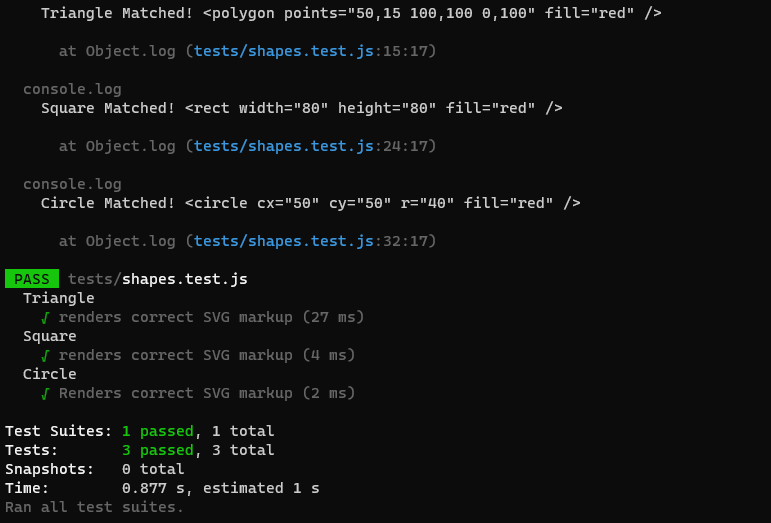
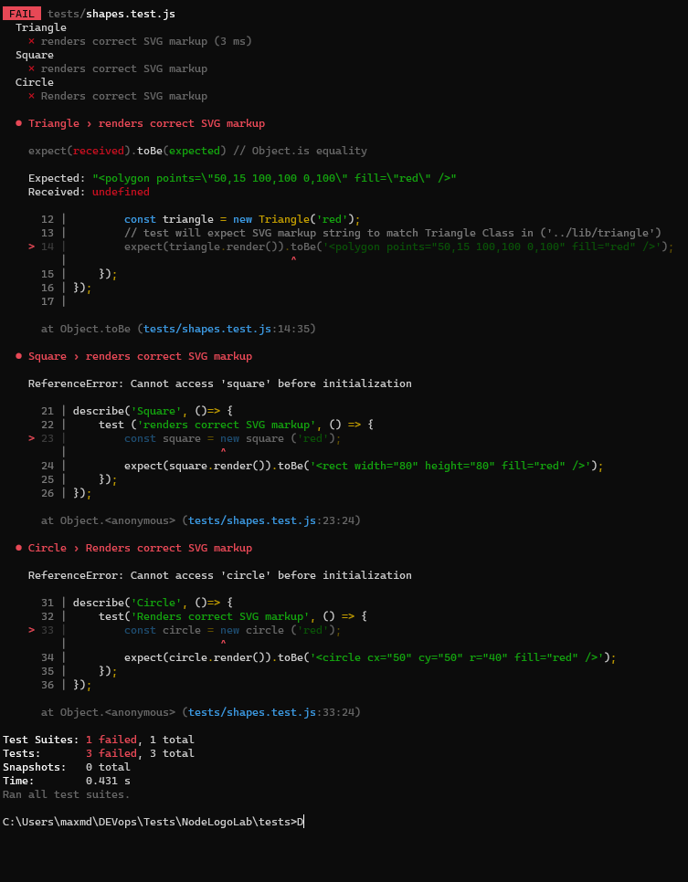

# NodeLogoLab

## Table of Contents
- [Description](#description)
- [Installation](#installation)
- [Usage](#usage)
- [Features](#features)
- [Contributing](#contributing)
- [Contact](#contact)
- [License](#license)

## Description
NodeLogoLab is a streamlined, Node.js-based command-line application designed to simplify the process of creating basic logos. This tool allows users to effortlessly generate custom logos through a few simple prompts. Users can choose from a selection of basic shapes, specify colors, and add up to three characters of text to craft their unique logo. The tool then combines these elements to produce a scalable vector graphic (SVG) file, renowned for its versatility and clarity at any size.

## Installation
To install NodeLogoLab, follow these steps:

1. **Clone the Repository:**
Replace `[URL to your repository]` with the actual URL of your GitHub repository.

2. **Navigate to the Project Directory:**

3. **Install Dependencies:**

## Usage
To use NodeLogoLab, run the following command in your terminal:

Follow the on-screen prompts to select your logo's shape, color, and text. The application will then generate a custom SVG logo based on your choices.

## Features
- Custom logo creation through command-line prompts.
- Selection of basic shapes and colors.
- Input for text customization up to three characters.
- Generation of scalable vector graphic (SVG) files.

## Contributing
NodeLogoLab is open to anybody that wants to customize or improve the tool. Contributions are welcome!

## Contact
- GitHub: [Maximilian93B](https://github.com/Maximilian93B)
- Email: [max.md.bosch@gmail.com](mailto:max.md.bosch@gmail.com)

## License
This project is licensed under the MIT License - see the [LICENSE.md](LICENSE.md) file for details.

## Test Cases
### Passed Test Cases

### Failed Test Cases

## Notes 
Happy Coding! Feel free to reach out for any questions or suggestions.